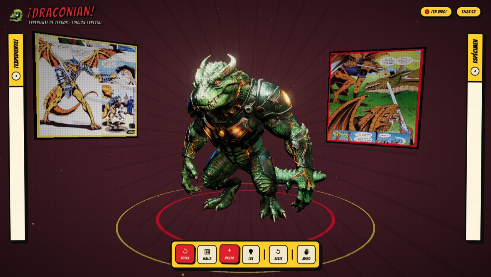

<div align="center">


<a href="https://fleremiasflemin20-maker.github.io/reptilian-interface/">
  
</a>

<br/><br/>


</div>

<br/>

<p align="center">
  
</p>

## Sobre el proyecto

Interfaz interactiva estilo "expediente de terror" que presenta un espécimen draconiano en 3D. El modelo se puede rotar, iluminar y explorar directamente en el navegador, ambientado con panel de cómics y una estética retro de revista pulp.

## Tecnologías

- **Three.js** — render y control del modelo 3D (`.glb`)
- **MediaPipe Tasks Vision** — control experimental por gestos de mano
- HTML5 / CSS3 / JavaScript vanilla (ES modules, sin build step)

## Ver el código localmente

```bash
git clone https://github.com/fleremiasflemin20-maker/reptilian-interface.git
cd reptilian-interface
npx serve .
```

> Nota: el repo incluye dos modelos `.glb` de ~80MB cada uno — la primera clonación puede tardar un poco.

<div align="center">

</div>
